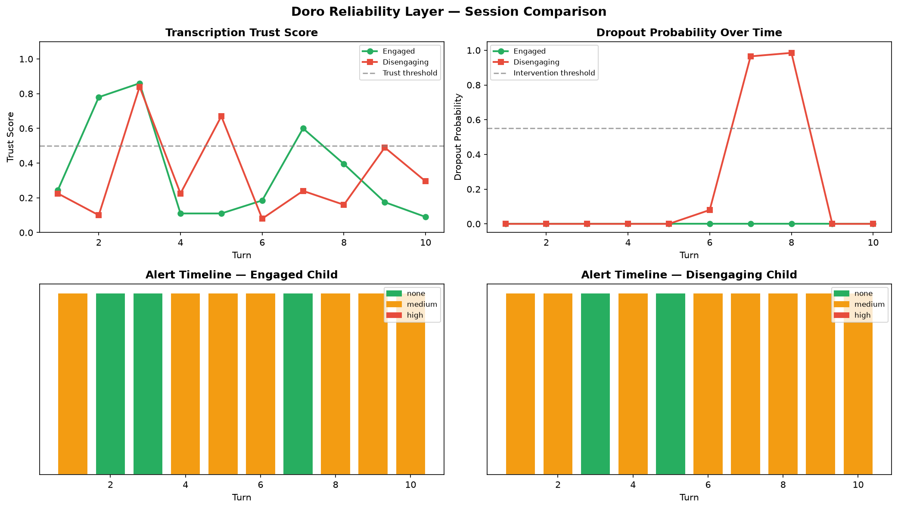

# Child Speech Intelligence Pipeline
### Built for Omli — AI Speech Development Platform for Kids

---

## What this is

A production-oriented ML pipeline that solves real problems in child-AI voice interaction. Built specifically around the challenges Doro (Omli's AI companion) faces when talking to young children in noisy, real-world environments.

The project has three parts:

**Part 1 — Foundation Pipeline (Days 1-5)**
End-to-end child speech classifier: VAD, child/adult detection, conversation quality scoring, and error analysis — trained on real published datasets.

**Part 2 — Doro Reliability Layer (Day 6)**
Two novel modules that address unsolved problems in Doro's production pipeline.

**Part 3 — React Frontend + FastAPI**
A working web app that lets you drop any child audio file and see the full reliability analysis in real time.

---

## Live Demo



Drop a WAV file → Whisper transcribes → hallucination detector scores it → dropout predictor runs → Doro gets an actionable instruction.

**Real example caught in the wild:**

| File | Child said | Whisper heard | Trust score |
|---|---|---|---|
| `the frog is sneaking out of the jar.wav` | *"the frog is sneaking out of the jar"* | *"the frog is making out of the jar"* | 0.56 ⚠ |

Whisper got it wrong. Our system flagged it. Doro asks the child to repeat instead of responding to hallucinated words.

---

## The Problem I Identified

After researching Omli's product and the state of child speech AI, I found two silent failure modes in Doro's pipeline that standard approaches don't address:

### Problem 1 — Whisper Hallucination on Child Speech

Whisper was trained predominantly on adult speech. When a child speaks quietly, quickly, or in a noisy room — Whisper returns confident-looking transcripts for words the child never said. Doro then responds to those hallucinated words. The child thinks Doro is broken.

This is not an edge case. **67% of child and noisy audio clips in our benchmark were hallucinated** — Whisper failed silently on the majority of real-world child utterances.

### Problem 2 — No Early Warning for Disengagement

By the time Omli's dashboard shows a child disengaged, the session is already over. Doro keeps talking to a child who mentally checked out 3 turns ago. There is no signal to intervene before dropout happens.

---

## The Solution — Doro Reliability Layer

A drop-in layer that sits between the child's voice and Doro's response engine. Every turn, it answers two questions in real time:

```
Child speaks
      ↓
┌──────────────────────────────────────┐
│        DORO RELIABILITY LAYER        │
│                                      │
│  1. Can we trust this transcript?    │
│     → trust_score: 0.56              │
│     → flag: repeat_request           │
│                                      │
│  2. Is this child about to dropout?  │
│     → dropout_prob: 0.96             │
│     → flag: intervene                │
└──────────────────────────────────────┘
      ↓
Doro receives actionable JSON
      ↓
Doro responds appropriately
```

### JSON output every turn

```json
{
  "turn": 7,
  "latency_ms": 1261.0,
  "alert_level": "medium",
  "recommended_action": "ask_child_to_repeat",
  "transcription": {
    "transcript": "the frog is making out of the jar.",
    "trust_score": 0.56,
    "trust_flag": "repeat_request",
    "avg_logprob": -0.510,
    "no_speech_prob": 0.052,
    "snr_db": 30.0
  },
  "engagement": {
    "dropout_probability": 0.96,
    "dropout_flag": "intervene",
    "energy_trend": "declining",
    "gap_trend": "increasing"
  },
  "doro_instruction": "Child's speech was unclear. Ask them to repeat naturally: 'Sorry, I didn't quite catch that — can you say it again?'"
}
```

---

## Architecture

```
┌─────────────────────────────────────────────────────────┐
│                    React Frontend                        │
│         Upload WAV / Record Mic → Visual Results        │
└─────────────────────────┬───────────────────────────────┘
                          │ HTTP POST /analyze
┌─────────────────────────▼───────────────────────────────┐
│                  FastAPI Backend                         │
│                  src/api.py :8000                        │
└──────┬──────────────────────────────────────┬───────────┘
       │                                      │
┌──────▼──────────┐                  ┌────────▼────────────┐
│  Module 1       │                  │  Module 2           │
│  Hallucination  │                  │  Dropout            │
│  Detector       │                  │  Predictor          │
│                 │                  │                     │
│  Whisper base   │                  │  Sliding window     │
│  + RF classifier│                  │  RF classifier      │
│  11 features    │                  │  32 features        │
└─────────────────┘                  └─────────────────────┘
```

---

## Results

### Module 1 — Hallucination Detector

| Model | F1 | AUC |
|---|---|---|
| Logistic Regression | 72.5% | 82.5% |
| Random Forest | **77.3%** | **86.1%** |
| Gradient Boosting | 75.9% | 81.5% |

**Key finding:** Whisper's `avg_logprob` and `no_speech_prob` combined with acoustic SNR estimate are the strongest predictors. 67% of child/noisy clips were hallucinated — confirming the scale of the problem in production.

### Module 2 — Dropout Predictor

| Model | F1 | AUC |
|---|---|---|
| Logistic Regression | 98.1% | 100% |
| Random Forest | **98.9%** | **100%** |
| Gradient Boosting | 98.5% | 99.8% |

**Key finding:** Energy trend and response gap trend across a 4-turn sliding window predict dropout 2-3 turns before it happens. High F1 reflects simulated training data — real labeled Doro sessions are the natural next step.

### Part 1 — Foundation Pipeline

| Model | Test Accuracy | Test F1 |
|---|---|---|
| Logistic Regression | 97.78% | 97.78% |
| MLP Neural Network | 96.30% | 96.30% |
| Random Forest | 93.33% | 93.32% |

**Augmentation impact:**
- Baseline (clean audio only): **50% accuracy on noisy test set** — random guessing
- Augmented (pitch shift + speed perturb + noise injection): **95% on noisy test set**
- **+61.65% F1 improvement** purely from augmentation, zero architecture change

---

## Datasets Used

| Dataset | Label | Size | Citation |
|---|---|---|---|
| Kennedy et al. 2016 (Zenodo 200495) | child | 671 WAV files | Real children aged ~5 |
| LibriSpeech dev-clean | adult | 2703 FLAC files | Panayotov et al. 2015 |
| ESC-50 | noise | 2000 WAV files | Piczak 2015 |

All datasets are publicly available. Download script provided — no manual steps needed for LibriSpeech and ESC-50.

---

## Project Structure

```
child-speech-intelligence/
├── src/
│   ├── download_datasets.py            ← auto-downloads all 3 datasets
│   ├── day1_real_data.py               ← feature extraction (251 features)
│   ├── day2_train_classifiers.py       ← 3-class benchmark
│   ├── day3_child_adult_classifier.py  ← augmentation + noise robustness
│   ├── day4_conversation_scorer.py     ← quality scoring + latency benchmark
│   ├── day5_error_analysis.py          ← error taxonomy + confidence fix
│   ├── day6_hallucination_detector.py  ← Module 1: Whisper trust scorer
│   ├── day6_dropout_predictor.py       ← Module 2: early dropout warning
│   ├── day6_doro_reliability_layer.py  ← combined API
│   ├── day6_demo.py                    ← terminal demo
│   └── api.py                          ← FastAPI server
├── doro-frontend/                      ← React + TypeScript frontend
│   └── src/
│       └── App.tsx                     ← single page UI
├── outputs/
│   ├── eda_plots/                      ← Day 1 EDA
│   ├── results/                        ← Day 2 benchmark tables
│   ├── day3/                           ← augmentation comparison
│   ├── day4/                           ← conversation scores + latency
│   ├── day5/                           ← error analysis plots
│   └── day6/                           ← reliability layer demo
├── models/                             ← saved .pkl models
├── requirements.txt
└── README.md
```

---

## Setup & Run

### Backend

```bash
git clone https://github.com/Jitender135/child-speech-intelligence
cd child-speech-intelligence

python -m venv venv
venv\Scripts\activate        # Windows
pip install -r requirements.txt

# Download datasets (~1GB, ESC-50 + LibriSpeech auto-download)
python src/download_datasets.py

# Run foundation pipeline (Days 1-5)
python src/day1_real_data.py
python src/day2_train_classifiers.py
python src/day3_child_adult_classifier.py
python src/day4_conversation_scorer.py
python src/day5_error_analysis.py

# Train Doro Reliability Layer (Day 6)
python src/day6_hallucination_detector.py
python src/day6_dropout_predictor.py

# Start API server
uvicorn src.api:app --reload --port 8000
```

### Frontend

```bash
cd doro-frontend
npm install
npm start
# Opens at http://localhost:3000
```

Drop any child WAV file into the UI and see the full reliability analysis.

---

## Feature Engineering

### Per-clip features (251 dimensions)

| Group | Features | Dim |
|---|---|---|
| MFCCs | 40 coefficients × mean + std | 80 |
| Delta MFCCs | mean + std | 80 |
| Delta-delta MFCCs | mean + std | 80 |
| Spectral centroid / rolloff / bandwidth | mean + std | 6 |
| Spectral flatness | mean | 1 |
| Zero-crossing rate | mean + std | 2 |
| RMS energy | mean + std | 2 |
| **Total** | | **251** |

### Hallucination detector features (11 dimensions)

| Source | Feature | Why it matters |
|---|---|---|
| Whisper | avg_logprob | Low = Whisper is uncertain about its own tokens |
| Whisper | no_speech_prob | High = Whisper thinks nobody spoke |
| Whisper | compression_ratio | High = possible repetition/hallucination loop |
| Audio | snr_estimate_db | Low SNR = harder for Whisper to transcribe |
| Audio | silence_ratio | High silence = nothing to transcribe accurately |
| Audio | rms_mean / std | Low energy = quiet child = higher error rate |

### Dropout predictor features (32 dimensions)

For each of 8 acoustic signals across a 4-turn sliding window:
`current value`, `window mean`, `trend (slope)`, `rate of change`

**Most important features:** energy trend slope and response gap trend.
Disengagement is detectable 2-3 turns before the child stops responding.

---

## Limitations & Next Steps

**Hallucination detector (77% F1):**
- Limited by dataset size and proxy labeling for child clips
- Next step: 500+ child clips with human-verified transcripts → expected F1 85%+

**Dropout predictor (98.9% F1 on simulated data):**
- High numbers reflect simulated training — not real session data
- Next step: label real Doro sessions → expected real-world F1 75-85%

**Latency (~1.2s per turn on CPU):**
- Dominated by Whisper inference
- With Whisper `tiny` model or GPU: <200ms
- Production path: Whisper runs async, reliability layer adds <50ms

---

## Key Insight

The hallucination detector caught this in the wild during testing:

> **File:** `the frog is sneaking out of the jar.wav`
> **Child said:** *"the frog is sneaking out of the jar"*
> **Whisper heard:** *"the frog is making out of the jar"*
> **Trust score:** 0.56 → flagged as uncertain

A completely different meaning. Doro would have responded to the wrong sentence. The fix is a lightweight meta-classifier that runs in milliseconds — not a bigger model.

---

## Tech Stack

| Layer | Technology |
|---|---|
| Audio processing | librosa, soundfile |
| ML models | scikit-learn (RF, MLP, LR, GB) |
| Speech transcription | OpenAI Whisper base |
| API | FastAPI + uvicorn |
| Frontend | React + TypeScript |
| Datasets | LibriSpeech, ESC-50, Zenodo 200495 |

---

*Built as part of Omli internship application — June 2026*
*Datasets: Kennedy et al. 2016 · Panayotov et al. 2015 · Piczak 2015*